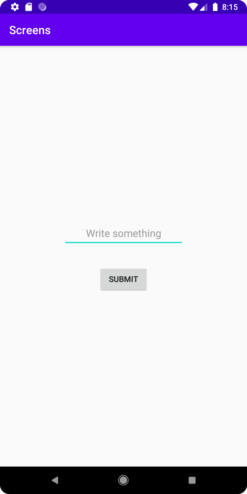
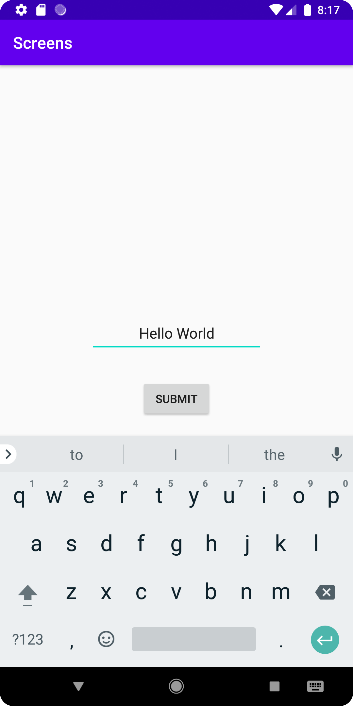
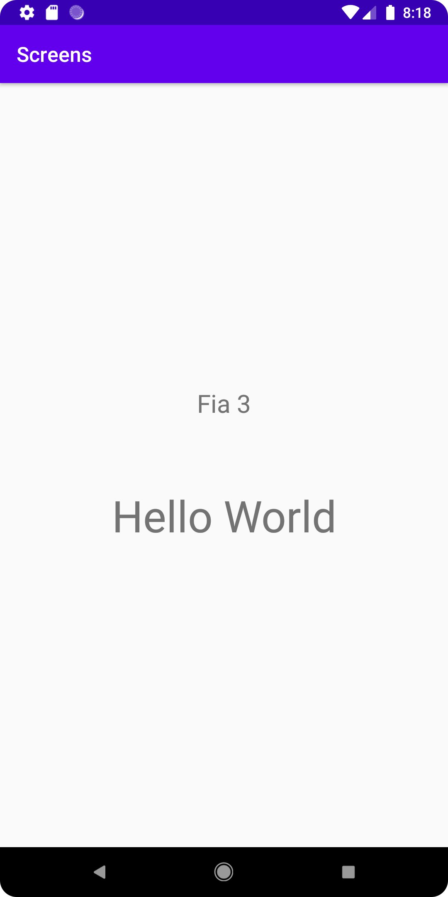

# Rapport

Första som skapades i projektet var en till activity som fick namnet activity_second.xml och
SecondActivity.java. I första activity skapades två element, ett editText element (se figur 1)
och ett Button element (se figur 2). Genom att klicka på knappen initieras en intent som tar användaren
till andra activity (se figur 4). Genom intenten skickas tre variabler med, två med satta värden och en 
som använder sig av värdet användaren skrev in i EditText från figur 1. I andra activity har två
TextView element lagts in (se figur 3) för att kunna visa värdena som skickats med i intenten.
Båda värdena som redan var satta visas tillsammans i ett av TextView elementet och värdet som 
användaren skrev in visas i det andra (se figur 5). 

Figur 1
````
<EditText
        android:id="@+id/editTextBox"
        android:layout_width="wrap_content"
        android:layout_height="48dp"
        android:layout_gravity="center_horizontal"
        android:layout_marginBottom="32dp"
        android:ems="10"
        android:hint="Write something"
        android:inputType=""
        android:textAlignment="center"
        app:layout_constraintBottom_toTopOf="@+id/myButton"
        app:layout_constraintEnd_toEndOf="parent"
        app:layout_constraintHorizontal_bias="0.5"
        app:layout_constraintStart_toStartOf="parent"
        app:layout_constraintTop_toTopOf="parent"
        app:layout_constraintVertical_chainStyle="packed" />
````
Figur 2
````
<Button
        android:id="@+id/myButton"
        android:layout_width="wrap_content"
        android:layout_height="wrap_content"
        android:text="Submit"
        app:layout_constraintBottom_toBottomOf="parent"
        app:layout_constraintEnd_toEndOf="parent"
        app:layout_constraintHorizontal_bias="0.5"
        app:layout_constraintStart_toStartOf="parent"
        app:layout_constraintTop_toBottomOf="@+id/editTextBox" />
````
Figur 3
````
<TextView
        android:id="@+id/myActivityText"
        android:layout_width="wrap_content"
        android:layout_height="wrap_content"
        android:layout_marginBottom="32dp"
        android:textSize="24sp"
        app:layout_constraintBottom_toTopOf="@+id/textR"
        app:layout_constraintEnd_toEndOf="parent"
        app:layout_constraintStart_toStartOf="parent"
        app:layout_constraintTop_toTopOf="parent"
        app:layout_constraintVertical_chainStyle="packed" />

<TextView
        android:id="@+id/textR"
        android:layout_width="wrap_content"
        android:layout_height="wrap_content"
        android:layout_marginTop="32dp"
        android:textSize="42sp"
        app:layout_constraintBottom_toBottomOf="parent"
        app:layout_constraintEnd_toEndOf="parent"
        app:layout_constraintStart_toStartOf="parent"
        app:layout_constraintTop_toBottomOf="@+id/myActivityText" />
````
Figur 4
````
Button btn = findViewById(R.id.myButton);
        final EditText txt = findViewById(R.id.editTextBox);

        btn.setOnClickListener(new View.OnClickListener() {
            @Override
            public void onClick(View view) {
                String getText = txt.getText().toString();
                Intent startNewActivity = new Intent(MainActivity.this, SecondActivity.class);
                startNewActivity.putExtra("name", "Fia");
                startNewActivity.putExtra("number", 3);
                startNewActivity.putExtra("text", getText);
                startActivity(startNewActivity);
            }
        });
````
Figur 5
````
Bundle extras = getIntent().getExtras();
        if(extras != null){
            String name = extras.getString("name");
            int number = extras.getInt("number");
            String text = extras.getString("text");
            TextView myText = findViewById(R.id.myActivityText);
            myText.setText(name+ " " + number);

            TextView getText = findViewById(R.id.textR);
            getText.setText(text);
        }
````
Bilder läggs i samma mapp som markdown-filen.




Läs gärna:

- Boulos, M.N.K., Warren, J., Gong, J. & Yue, P. (2010) Web GIS in practice VIII: HTML5 and the canvas element for interactive online mapping. International journal of health geographics 9, 14. Shin, Y. &
- Wunsche, B.C. (2013) A smartphone-based golf simulation exercise game for supporting arthritis patients. 2013 28th International Conference of Image and Vision Computing New Zealand (IVCNZ), IEEE, pp. 459–464.
- Wohlin, C., Runeson, P., Höst, M., Ohlsson, M.C., Regnell, B., Wesslén, A. (2012) Experimentation in Software Engineering, Berlin, Heidelberg: Springer Berlin Heidelberg.
